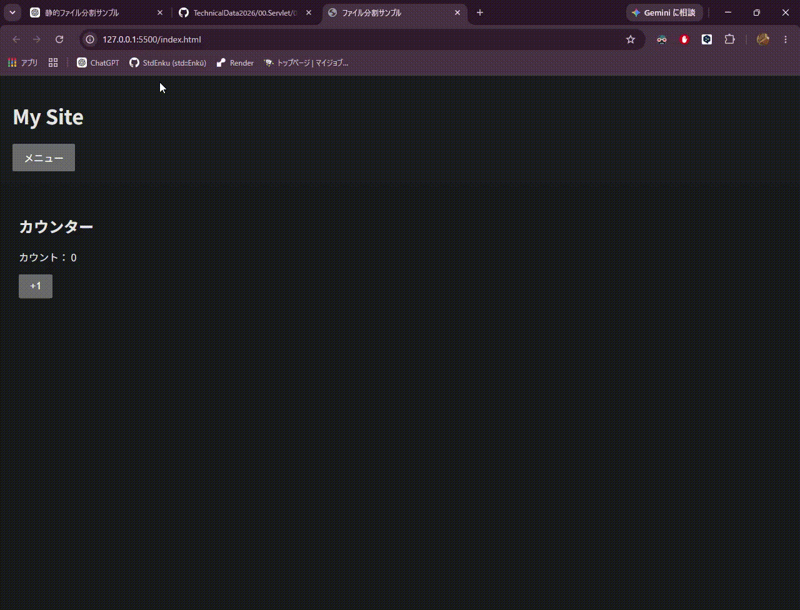

# HTML/CSS/JavaScriptの連携例



## プロジェクト構成
```text
my-site/
├── index.html
├── css/
│   ├── base.css
│   ├── header.css
│   └── button.css
└── js/
    ├── main.js
    ├── menu.js
    └── counter.js
```
## 1. HTML → CSS
index.htmlからCSSを読み込みます。  
```html
<link rel="stylesheet" href="css/base.css">
<link rel="stylesheet" href="css/header.css">
<link rel="stylesheet" href="css/button.css">
```  
つまり、
```text
index.html
    ↓
css/base.css
css/header.css
css/button.css
```
です。

CSSはHTML要素を選択して、見た目を変更します。

## 2. HTML → JavaScript
HTMLからJavaScriptの入口となるmain.jsを読み込みます。  
```html
<script type="module" src="js/main.js"></script>
```  
main.jsがJavaScript全体の入口です。

## 3. JavaScript → JavaScript
main.jsから必要な機能をimportします。
```JavaScript
import { setupMenu } from "./menu.js";
import { setupCounter } from "./counter.js";

setupMenu();
setupCounter();
```
つまり、  
```text
main.js
 ├── menu.js
 └── counter.js
```
という関係です。

## 4. JavaScript → HTML
JavaScriptはDOMを通してHTMLを操作します。  
例えばcounter.jsでは、
```JavaScript
const button = document.getElementById("countButton");
const counter = document.getElementById("counter");
```
によってHTMLの、
```html
<button id="countButton">+1</button>
<span id="counter">0</span>
```
を取得しています。

そして、

```JavaScript
counter.textContent = count;
```

によってHTMLの表示を書き換えます。

## 全体像
```text
                    ┌──────────────┐
                    │  index.html  │
                    └──────┬───────┘
                           │
             ┌─────────────┴─────────────┐
             ↓                           ↓
       CSSを読み込む                main.jsを読み込む
             ↓                           ↓
     ┌───────────────┐           ┌───────┴───────┐
     │ base.css      │           ↓               ↓
     │ header.css    │       menu.js        counter.js
     │ button.css    │           │               │
     └───────────────┘           └───────┬───────┘
                                         ↓
                                  HTML(DOM)を操作
```
要するに、

HTMLが全体の構造を作る → CSSが見た目を担当 → JSがDOMを操作して動きを付ける

という関係です。

そしてファイル分割した場合でも、HTML・CSS・JSが別々の世界になるわけではなく、HTMLを中心にCSSとJSが連携していると考えると理解しやすいです。